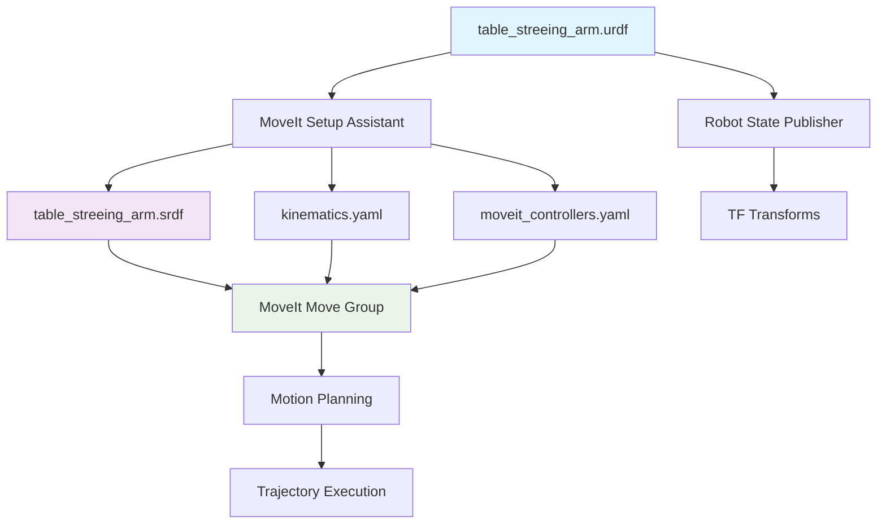

# table_streeing_arm 包分析及其与 table_streeing_arm_config 的关系

## 概述

`table_streeing_arm` 是一个 **机器人描述包**，包含了 table_streeing_arm 机械臂的完整物理描述、3D模型和基础可视化功能。它是整个机器人系统的**基础包**，为其他高级功能包（如 MoveIt 配置）提供机器人的几何和物理信息。

## 包信息

- **包名**: `table_streeing_arm`
- **版本**: 0.0.0
- **描述**: The table_streeing_arm package
- **维护者**: your_name (your_email@example.com)
- **许可证**: TODO

## 包的结构和功能

### 1. 目录结构

```
table_streeing_arm/
├── CMakeLists.txt
├── package.xml
├── urdf/                    # 机器人描述文件
│   └── table_streeing_arm.urdf
├── meshes/                  # 3D网格模型文件
│   ├── base_link.STL
│   ├── link_1.STL
│   ├── link_2.STL
│   ├── ...
│   └── link_11.STL
├── config/                  # 配置文件
│   └── display.rviz
├── launch/                  # 启动文件
│   └── display.launch.py
└── textures/               # 纹理文件
```

### 2. 核心功能

#### A. 机器人几何描述 (URDF)
`table_streeing_arm.urdf` 文件定义了完整的机器人结构：

**机械臂主体**（arm_group）：
- `joint_1`: 基座旋转关节 (revolute, ±1.57 rad)
- `joint_2`: 肩关节 (revolute, ±1.57 rad)  
- `joint_3`: 肘关节 (revolute, ±1.57 rad)
- `joint_4`: 腕关节1 (revolute, ±1.57 rad)
- `joint_5`: 腕关节2 (revolute, ±1.57 rad)

**夹爪组**（gripper_group）：
- `joint_6`: 夹爪基座 (revolute, ±0.9 rad)
- `joint_7`: 夹爪手指1 (revolute, ±0.9 rad)
- `joint_8`: 夹爪手指2 (revolute, ±0.9 rad)
- `joint_9`: 夹爪手指3 (revolute, ±0.9 rad)
- `joint_10`: 夹爪辅助关节1 (revolute, ±0.9 rad)
- `joint_11`: 夹爪辅助关节2 (revolute, ±0.9 rad)

#### B. 3D可视化模型
- 每个连杆都有对应的 STL 网格文件
- 用于 RViz 可视化和碰撞检测
- 由 SolidWorks 自动生成的高精度模型

#### C. 物理属性定义
- 每个连杆的质量、惯性矩阵
- 关节的运动限制（位置、速度、扭矩）
- 碰撞几何体定义

#### D. 基础可视化功能
`display.launch.py` 提供：
- Robot State Publisher: 发布机器人TF变换
- Joint State Publisher: 发布关节状态
- Joint State Publisher GUI: 交互式关节控制界面
- RViz2: 3D可视化

### 3. 依赖关系

```xml
<depend>rclcpp</depend>
<depend>rclpy</depend>
<depend>std_msgs</depend>
<depend>sensor_msgs</depend>
<depend>geometry_msgs</depend>
<depend>tf2_ros</depend>
<depend>urdf</depend>
<depend>xacro</depend>
```

## 与 table_streeing_arm_config 的关系

### 1. 层次关系

```
table_streeing_arm (基础层)
    ↓ 提供机器人描述
table_streeing_arm_config (应用层)
    ↓ 提供运动规划配置
hello_moveit (用户层)
```

### 2. 依赖关系

#### A. 直接引用关系
在 `table_streeing_arm_config` 的 `.setup_assistant` 文件中：
```yaml
urdf:
  package: table_streeing_arm                    # 引用基础包
  relative_path: urdf/table_streeing_arm.urdf   # 引用URDF文件
```

#### B. URDF包含关系
在 `table_streeing_arm_config/config/table_streeing_arm.urdf.xacro` 中：
```xml
<!-- Import table_streeing_arm urdf file -->
<xacro:include filename="$(find table_streeing_arm)/urdf/table_streeing_arm.urdf" />
```

#### C. 包依赖声明
在 `table_streeing_arm_config/package.xml` 中：
```xml
<exec_depend>table_streeing_arm</exec_depend>
```

### 3. 功能分工

| 功能 | table_streeing_arm | table_streeing_arm_config |
|------|-------------------|---------------------------|
| 机器人几何描述 | ✅ 提供 URDF | ❌ 引用 |
| 3D模型文件 | ✅ 提供 STL 文件 | ❌ 引用 |
| 基础可视化 | ✅ display.launch.py | ❌ |
| 运动组定义 | ❌ | ✅ SRDF 配置 |
| 运动规划器 | ❌ | ✅ OMPL/Pilz 配置 |
| 控制器配置 | ❌ | ✅ MoveIt 控制器 |
| 逆运动学求解器 | ❌ | ✅ KDL 配置 |
| 碰撞检测规则 | ❌ | ✅ SRDF 配置 |
| 预定义姿态 | ❌ | ✅ home, fold 等 |

### 4. 数据流关系



### 5. 使用场景对比

#### 仅使用 table_streeing_arm：
```bash
# 基础可视化和手动控制
ros2 launch table_streeing_arm display.launch.py
```
- 适用于：机器人模型查看、手动关节控制、URDF调试

#### 使用 table_streeing_arm_config：
```bash
# 完整的MoveIt功能
ros2 launch table_streeing_arm_config demo.launch.py
```
- 适用于：自动运动规划、路径规划、碰撞避免、程序控制

## 开发和定制指南

### 1. 修改机器人模型
- **位置**: `table_streeing_arm/urdf/table_streeing_arm.urdf`
- **影响**: 自动传播到 MoveIt 配置
- **注意**: 修改后需要重新运行 MoveIt Setup Assistant

### 2. 添加新的连杆或关节
1. 更新 `table_streeing_arm.urdf`
2. 添加对应的 STL 模型文件
3. 重新配置 `table_streeing_arm_config`

### 3. 修改关节限制
- **位置**: `table_streeing_arm.urdf` 中的 `<limit>` 标签
- **同步**: `table_streeing_arm_config/config/joint_limits.yaml`

### 4. 版本兼容性
两个包需要保持同步：
- URDF结构变化 → 重新生成MoveIt配置
- 关节名称变化 → 更新SRDF和控制器配置
- 连杆结构变化 → 重新配置碰撞检测

## 故障排除

### 1. 模型不显示
- 检查 `package://table_streeing_arm/meshes/` 路径
- 确认 STL 文件存在且可读

### 2. 关节控制异常
- 验证关节名称一致性
- 检查关节限制设置

### 3. MoveIt配置失效
- 确认 `table_streeing_arm` 包已正确编译
- 重新运行 MoveIt Setup Assistant

## 启动和测试

### 1. 基础可视化测试
```bash
# 终端1: 启动机器人显示
ros2 launch table_streeing_arm display.launch.py

# 检查话题
ros2 topic list | grep joint
ros2 topic echo /joint_states
```

### 2. MoveIt集成测试
```bash
# 终端1: 启动MoveIt
ros2 launch table_streeing_arm_config demo.launch.py

# 终端2: 运行控制程序
ros2 run hello_moveit simple_move
```

### 3. 依赖关系验证
```bash
# 检查包依赖
ros2 pkg xml table_streeing_arm_config | grep table_streeing_arm

# 检查文件引用
grep -r "table_streeing_arm" src/table_streeing_arm_config/
```

---

## 总结

`table_streeing_arm` 是整个机器人系统的**基础设施包**，提供了机器人的完整物理描述和基础功能。`table_streeing_arm_config` 是建立在这个基础之上的**应用层包**，专门为 MoveIt 运动规划提供高级配置。

两者的关系类似于**操作系统与应用软件**的关系：
- `table_streeing_arm` = 硬件驱动层（定义机器人是什么）
- `table_streeing_arm_config` = 应用软件层（定义机器人能做什么）

理解这种分层架构对于机器人系统的开发、维护和扩展至关重要。

---

*文档创建时间: 2025年1月5日*
*相关包版本: table_streeing_arm v0.0.0, table_streeing_arm_config v0.3.0* 